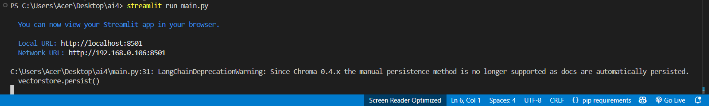
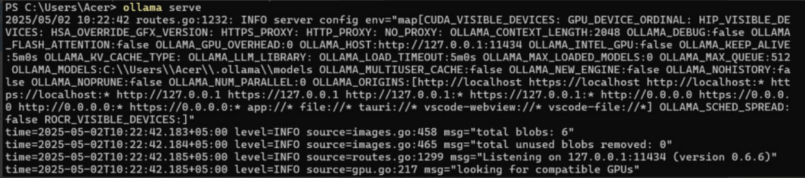
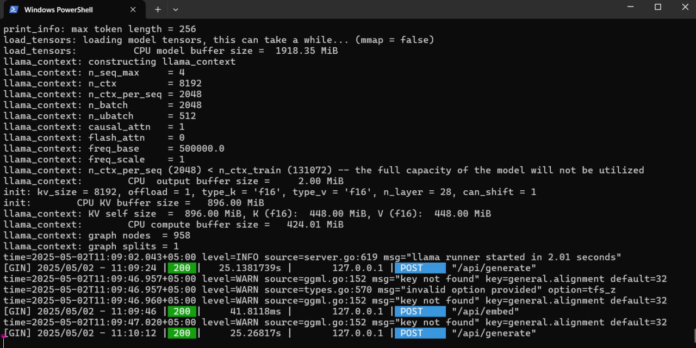
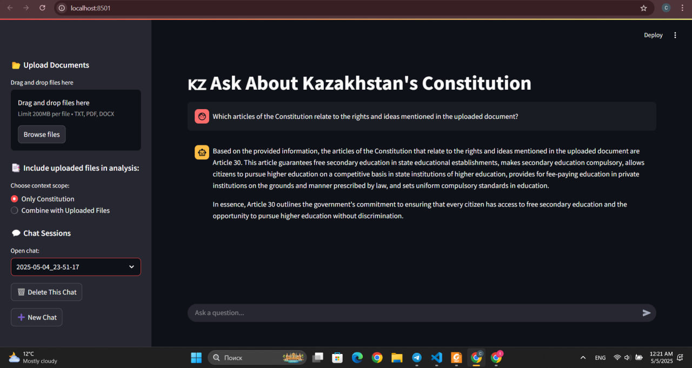
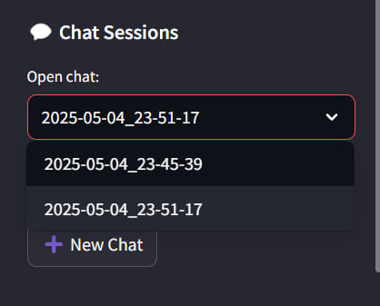
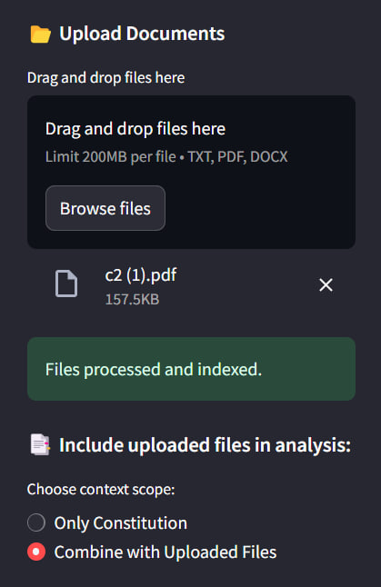

# 🇰🇿 Constitutional AI Assistant

An AI-powered assistant to answer questions related to the **Constitution of the Republic of Kazakhstan**. Built using **Streamlit**, **Ollama**, and **ChromaDB**.

---

## 🚀 Features

- 🤖 Ask questions about the Constitution of Kazakhstan (in English or Russian)
- 📂 Upload multiple files (.txt, .pdf, .docx) for context-aware Q&A
- 💬 Chat interface with history saving/loading
- 🧠 LLM-powered using `llama3.2` via Ollama
- 🧾 Vector Store with `ChromaDB` for RAG
- 💾 Auto-save chat sessions (JSON)

---

## 🖼️ Demo Screenshots

### Launch Streamlit App


### Ollama Backend Running


### Q&A from Constitution (Article 11)


### Combine Mode: Constitution + Uploaded File


### Chat History Dropdown


### Upload and Index Files


---

## 🛠️ Usage

1. Clone the repo:
   ```bash
   git clone https://github.com/tomiristapen/ConstitutionalAI.git
   cd ConstitutionalAI
   ```
2. Start:
   ```bash
   .venv\Scripts\activate
   streamlit run main.py
   ```
3. Open the browser and test